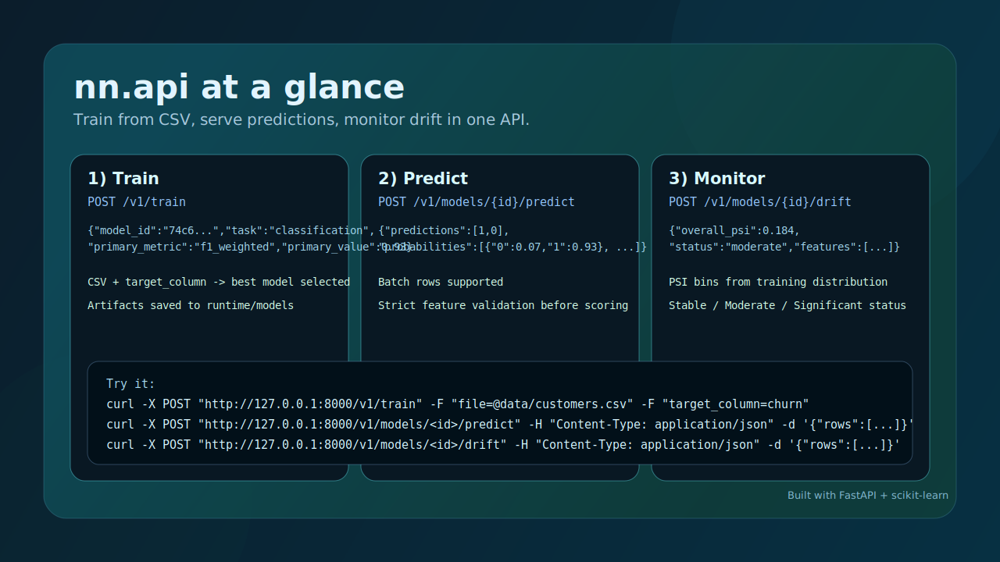

# nn.api

`nn.api` is a modern API for tabular machine learning.

It lets you train a model from CSV in one call, serve predictions immediately, and monitor incoming data drift with PSI (Population Stability Index).



## Features
- One-call training from an uploaded CSV file
- Automatic task detection (classification or regression)
- Numeric and categorical preprocessing built in
- Local model registry and artifact storage
- Batch prediction endpoint with optional class probabilities
- Drift detection endpoint for numeric features
- Tests covering training, prediction, and drift checks

## Quickstart

### 1) Install
```bash
python -m venv .venv
. .venv/Scripts/activate
pip install -e .[dev]
```

### 2) Run
```bash
uvicorn app.main:app --reload
```

### 3) Train a model
```bash
curl -X POST "http://127.0.0.1:8000/v1/train" \
  -F "file=@data/customers.csv" \
  -F "target_column=churn" \
  -F "model_name=customer-churn"
```

### 4) Predict
```bash
curl -X POST "http://127.0.0.1:8000/v1/models/<model_id>/predict" \
  -H "Content-Type: application/json" \
  -d '{"rows":[{"age":37,"income":54000,"plan":"basic","sessions":3,"last_login_days":14}],"include_probabilities":true}'
```

### 5) Check drift
```bash
curl -X POST "http://127.0.0.1:8000/v1/models/<model_id>/drift" \
  -H "Content-Type: application/json" \
  -d '{"rows":[{"age":61,"income":130000,"plan":"basic","sessions":1,"last_login_days":40}]}'
```

## Endpoints
- `GET /health`
- `POST /v1/train`
- `GET /v1/models`
- `GET /v1/models/{model_id}`
- `POST /v1/models/{model_id}/predict`
- `POST /v1/models/{model_id}/drift`

## Developer Commands
```bash
make install
make test
make run
```

## Notes
- Runtime artifacts are written to `runtime/`.
- Set `NN_API_DATA_DIR` to override the storage path.
